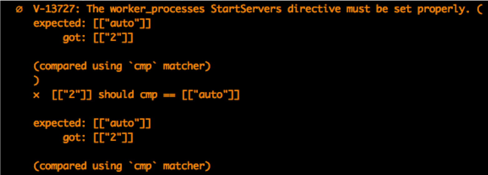
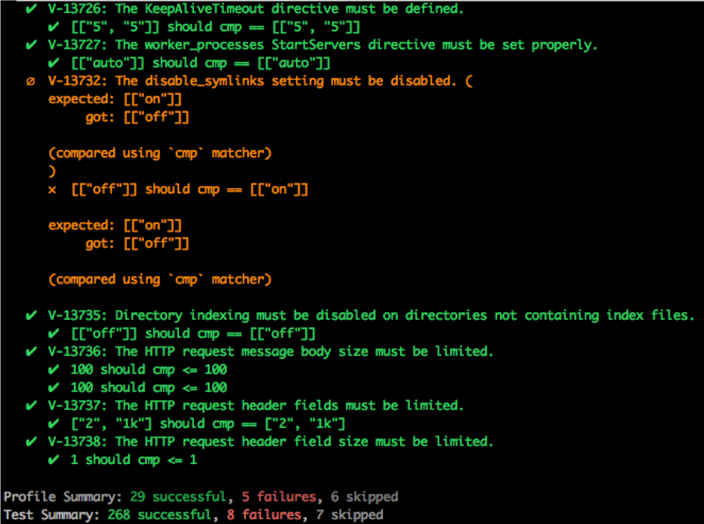
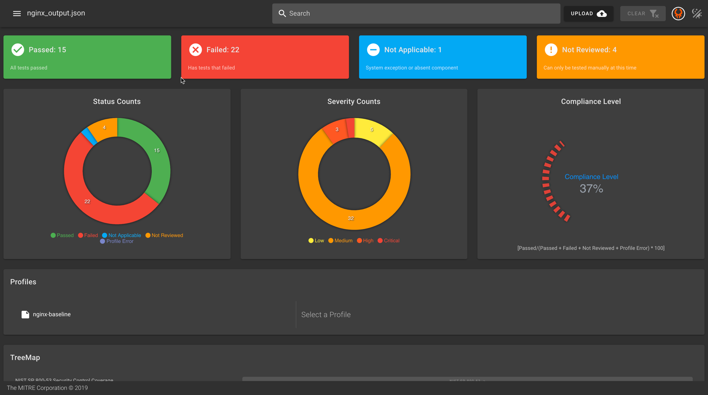

In the [first class](https://mitre-inspec-developer.netlify.app/course/02.html), we explained the structure and output of InSpec Profiles. Let's review some content, then practice by  writing, running, and viewing results of a new control.

## InSpec Content Review
### InSpec Profile Structure
Remember that a `profile` is a set of automated tests that usually relates directly back to a Security Requirements Benchmark.

Profiles have two (2) required elements:
- An `inspec.yml` file 
- A `controls` directory

and four (4) optional elements: 
- A `libraries` directory 
- A `files` directory
- An `inputs.yml` file 
- A `README.md` file

### Control Structure

Let's take a look at the default control file, `controls/example.rb`.

```ruby
title 'sample section'

# you can also use plain tests
describe file('/tmp') do
  it { should be_directory }
end

# you add controls here
control 'tmp-1.0' do                        # A unique ID for this control
  impact 0.7                                # The criticality, if this control fails.
  title 'Create /tmp directory'             # A human-readable title
  desc 'An optional description...'
  describe file('/tmp') do                  # The actual test
    it { should be_directory }
  end
end
```

This example shows two tests. Both tests check for the existence of the `/tmp` directory. The second test provides additional information about the test. Let's break down each component.

- `control` (line 9) is followed by the control's name. Each control in a profile has a unique name.
- `impact` (line 10) measures the relative importance of the test and must be a value between 0.0 and 1.0.
- `title` (line 11) defines the control's purpose.
- `desc` (line 12) provides a more complete description of what the control checks for.
- `describe` (lines 13 — 15) defines the test. Here, the test checks for the existence of the `/tmp` directory.

### Describe Block Structure

As with many test frameworks, InSpec code resembles natural language. Here's the format of a describe block.

```ruby
describe <entity> do
  it { <expectation> }
end
```

::: tip Inspec Resources
InSpec uses resources like the `file` resource to aid in control development. These resources can often be used as the `<entity>` in the describe block, where the expectation is checking a requirement of that entity. Find a list of resources [here](https://docs.chef.io/inspec/resources/).
:::

<!-- ### 2.1. InSpec Profile Structure
```bash
$ tree nginx
      nginx
      └── profile
          ├── README.md
          ├── attributes.rb
          ├── controls
          │   ├── header_size.rb
          │   └──  ssl_certification.rb
          ├── inspec.yml
          └── libraries
              └── nginx_helper.rb
```
---
### 2.2. InSpec Controls Structure
```ruby
control "V-13727" do
  title "The worker_processes StartServers directive must be set properly."

  desc "These requirements are set to mitigate the effects of several types of
  denial of service attacks. Although there is some latitude concerning the
  settings themselves, the requirements attempt to provide reasonable limits
  for the protection of the web server. If necessary, these limits can be
  adjusted to accommodate the operational requirement of a given system."

  impact 0.5
  tag "severity": "medium"
  tag "gtitle": "WA000-WWA026"
  tag "gid": "V-13727"
  tag "rid": "SV-36645r2_rule"
  tag "stig_id": "WA000-WWA026 A22"
  tag "nist": ["CM-6", "Rev_4"]

  tag "check": "To view the worker_processes directive value enter the
  following command:
  grep ""worker_processes"" on the nginx.conf file and any separate included
  configuration files
  If the value of ""worker_processes"" is not set to auto or explicitly set,
  this is a finding:
  worker_processes   auto;
  worker_processes defines the number of worker processes. The optimal value
  depends on many factors including (but not limited to) the number of CPU
  cores, the number of hard disk drives that store data, and load pattern. When
  one is in doubt, setting it to the number of available CPU cores would be a
  good start (the value “auto” will try to autodetect it)."

  tag "fix": "Edit the configuration file and set the value of
  ""worker_processes"" to the value of auto or a value of 1 or higher:
  worker_processes auto;"

  describe nginx_conf(NGINX_CONF_FILE).params['worker_processes'] do
    it { should cmp [['auto']] }
  end
end
```

### 2.3. InSpec Results
#### 2.3.1. Failure


#### 2.3.2. Pass


#### 2.3.3. Multiple Controls


### 2.4. Tooling and Reporting


### 2.5. InSpec Resources
```ruby
class GordonConfig < Inspec.resource(1)
  name 'gordon_config'

  # Restrict to only run on the below platforms (if none were given, all OS's supported)
  supports platform_family: 'fedora'
  supports platform: 'centos', release: '6.9'
  # Supports `*` for wildcard matcher in the release
  supports platform: 'centos', release: '7.*'

  desc '
    Resource description ...
  '

  example '
    describe gordon_config do
      its("signal") { should eq "on" }
    end
  '

  # Load the configuration file on initialization
  def initialize(path = nil)
    @path = path || '/etc/gordon.conf'
    @params = SimpleConfig.new( read_content )
  end

  # Expose all parameters of the configuration file.
  def method_missing(name)
    @params[name]
  end

  private

  def read_content
    f = inspec.file(@path)
    # Test if the path exist and that it's a file
    if f.file?
      # Retrieve the file's contents
      f.content
    else
      # If the file doesn't exist, skip all tests that use gordon_config
      raise Inspec::Exceptions::ResourceSkipped, "Can't read config at #{@path}"
    end
  end
end
``` -->