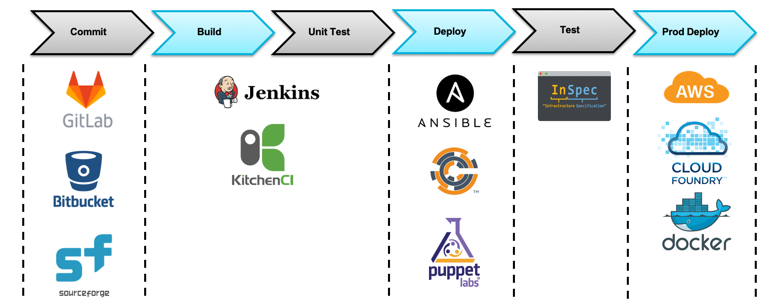
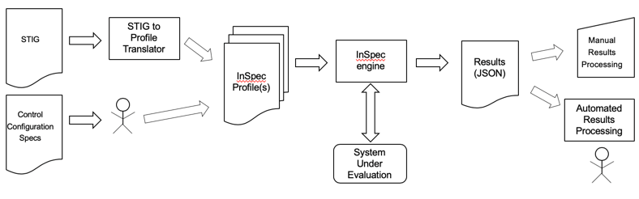
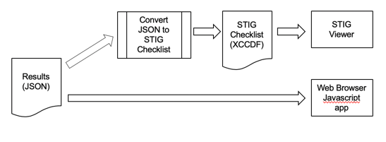

## Course Objectives
The purpose of this course is to take you beyond profile development and give you the tools to actively participate in the open source security automation community. The advanced course builds off of the beginner course fundamentals, and by the end, you should be able to achieve all of these objectives.

### Beginner course fundamentals:
-	Describe the InSpec framework and its capabilities
-	Describe the architecture of an InSpec profile
-	Build an InSpec profile to transform security policy into automated security testing
-	Inherit controls from existing profile baselines into your profiles to avoid rework
-	Run an InSpec profile against a target - a component of an application stack
-	View and analyze InSpec results
-	Report results
-	Create concise, human-readable control output using RSpec syntax in InSpec profiles

### Advanced course objectives:
-   Develop resources to aid in creating controls
-	Automate security testing by integrating InSpec into a CI/CD pipeline
-	Contribute to an open-source security platform by pushing the resources you develop to the InSpec framework

Orchestration, Configuration Management, Validation to Deployment
InSpec operates with most orchestration and CM tools found in the DevOps pipeline implementations

---

Automating Security Validation Using InSpec

---

Processing InSpec Results

## Where can I start on my own?
You can contribute to existing profiles that can be found here:  
[https://github.com/mitre](https://github.com/mitre)  

Otherwise you can create your own profiles if they don't exist using the following security guidelines:  
[https://public.cyber.mil/stigs/downloads/](https://public.cyber.mil/stigs/downloads/)  
[https://www.cisecurity.org/cis-benchmarks/](https://www.cisecurity.org/cis-benchmarks/)  
